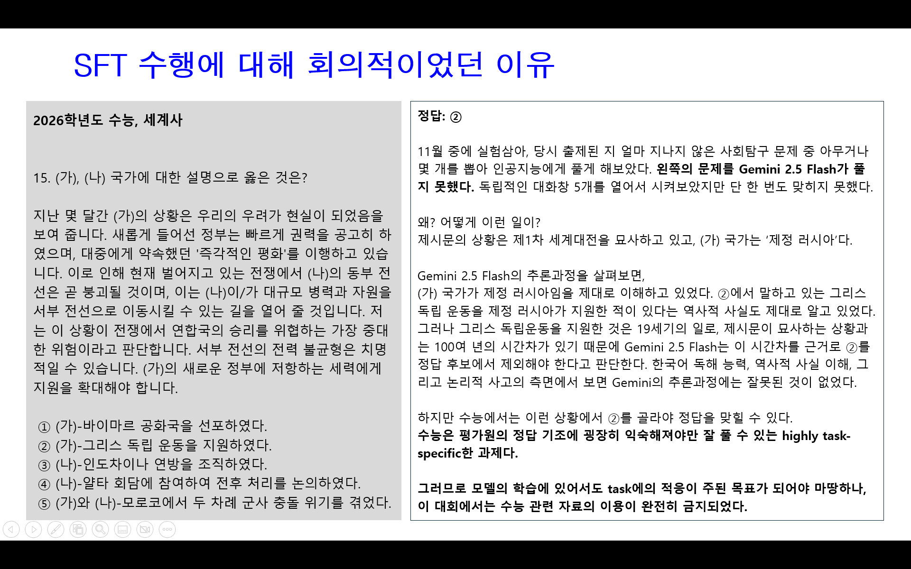
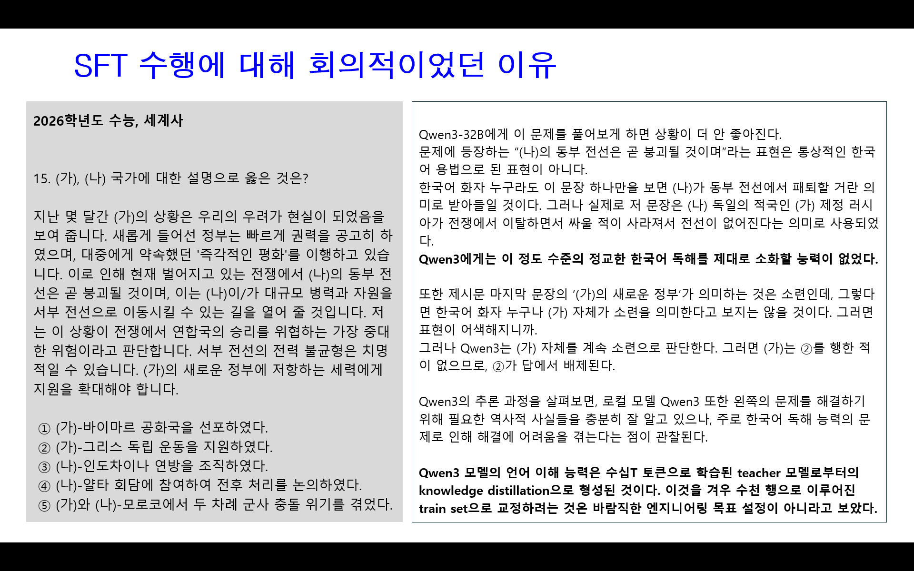

## 소개
'NLP 팀 프로젝트 2: 수능형 문제 풀이 모델 생성'에서 NLP-05가 작성한 4가지의 솔루션 중 하나이자, 최종 제출 솔루션입니다.  
1. 먼저 Gemma3-27B 모델이 Test set 문항으로부터 지식증강을 요청할 키워드를 선정하고,  
2. 키워드 모음을 가지고 나무위키 데이터베이스 덤프로부터 Sparse RAG를 수행한 뒤,  
3. Qwen3-32B 모델이 문항과 증강지식을 이용하여 답을 도출합니다.

## 결과
| 리더보드 | Macro-F1 |
|---|---|
| Public | 0.8533 (2위) |
| Private | 0.7774 (3위) |

## 특징
Parameter-tuning을 수행하지 않았습니다.  
Train set을 이용한 parameter-tuning이 본 대회의 태스크 수행에 있어 적합한 방법이 아니라고 판단했습니다. 이유는 수능 문제풀이에 있어 오답의 주된 원인이  
1. 모델이 수능의 정답기조에 익숙하지 않음
2. 꼬아서 내는 글을 소화할만큼 한국어를 섬세하게 독해하지 못함

에 있으며, SFT는 이 두 문제점에 대한 해결방안이 되기 어렵다고 판단했기 때문입니다.

  

  

## 코드 구성
아래에 기재된 순서대로 실행합니다.

| 파일명 | 역할 |
|---|---|
| [Setup.sh](./Setup.sh) | 제공된 프로젝트 서버에 추론 엔진 llama.cpp를 설치하기 위한 환경설정 파일입니다. |
| [TestSet_Classification.ipynb](./TestSet_Classification.ipynb) | Gemma3 모델이 test set의 문항에 '과목명 - 단원명'을 labeling합니다.  |
| [Class_Parser.ipynb](./Class_Parser.ipynb) | Labeling 요청에 대한 Gemma3의 답변으로부터 '과목명'과 '단원명'을 파싱합니다. 이것은 '국어'나 '문학'으로 분류된 문항에 대해서는 RAG를 적용하지 않기 위한 조치입니다. |
| [TestSet_ExtractKewWord.ipynb](./TestSet_ExtractKewWord.ipynb) | Gemma3 모델이 test set의 문항에서 증강지식을 요청할 개념들을 선별합니다. |
| [Keyword_Parser.ipynb](./Keyword_Parser.ipynb) | 개념 선별 요청에 대한 Gemma3의 답변으로부터 key word들을 정제합니다. |
| [NamuWiki_AhoCorasick.ipynb](./NamuWiki_AhoCorasick.ipynb) | 나무위키 데이터베이스 덤프에서 key word들이 포함된 문장을 검색하고, 각 key word들에 자신을 포함하는 문장들의 인덱스를 기록하는 역색인 생성 작업을 수행합니다. |
| [Preprocess_for_RAG.ipynb](./Preprocess_for_RAG.ipynb) | key word를 포함하는 문장을 인접 문장들과 결합하여 길이 800을 초과하지 않는 긴 텍스트로 변환합니다. |
| [ReRanking.ipynb](./ReRanking.ipynb) | 앞 단계에서 생성한 텍스트들의 집합에서 각 test set 문항이 요청한 key word들의 모임으로 BM25 점수를 계산하고, 문항별로 top-4 텍스트를 선정합니다. 이 때 reranker 모델이 매긴 관련도 점수가 충분히 높지 않다면(<0.7) top-4가 채워지지 않았더라도 선정하지 않습니다. |
| [TestSet_Inference.ipynb](./TestSet_Inference.ipynb) | Qwen3 모델이 test set 문항과 top-4 증강지식으로 이루어진 프롬프트를 입력받아 문제풀이를 수행합니다. Sampling argument는 Qwen3의 official recommendation인 temperature=0.7를 준수하면서 답변을 여러 번 생성합니다. |
| [Answer_Parser.ipynb](./Answer_Parser.ipynb) | 문제풀이 수행과정으로부터 정답의 번호를 파싱하고 hard-voting하여 제출 파일을 생성합니다. |
